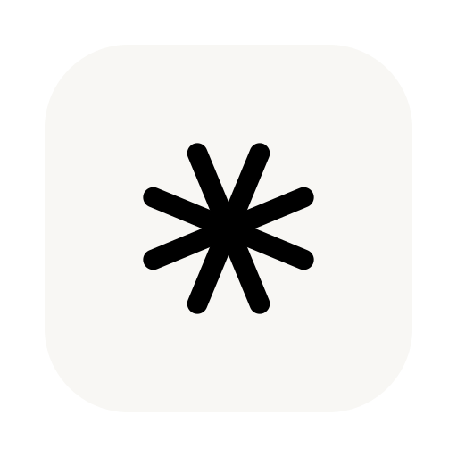

<div align="center">



# Hop

**همراهی کوچک در نوار منوی macOS: تایمر، ردیاب زمان، فهرست کارها، جلوگیری از
خواب، پایشگر سیستم، تاریخچهٔ کلیپ‌بورد، مبدل پرونده، مدیر پنجره و کلاینت سبک
تورنت — چیده روی چهار زبانه در نماد. یک کلیک، و هرچه لازم دارید همان‌جاست.**

[](https://github.com/antonyshakirov/hop/releases/latest)
[](https://www.antonshakirov.com/api/hop/installs)
[](https://github.com/antonyshakirov/hop/actions/workflows/ci.yml)
[](https://github.com/antonyshakirov/hop/actions/workflows/codeql.yml)
[](../../LICENSE)

[](https://github.com/antonyshakirov/hop/stargazers)

[Bahasa Indonesia](README.id.md) · [Deutsch](README.de.md) · [English](../../README.md) · [Español](README.es.md) · [Français](README.fr.md) · [Italiano](README.it.md) · [Nederlands](README.nl.md) · [Polski](README.pl.md) · [Português](README.pt.md) · [Tiếng Việt](README.vi.md) · [Türkçe](README.tr.md) · [Русский](README.ru.md) · [Українська](README.uk.md) · [עברית](README.he.md) · [اردو](README.ur.md) · [العربية](README.ar.md) · **فارسی** · [हिन्दी](README.hi.md) · [ไทย](README.th.md) · [한국어](README.ko.md) · [中文](README.zh.md) · [日本語](README.ja.md)


</div>

Hop در نوار منوی Mac می‌نشیند و جای مشتی ابزار کوچک را می‌گیرد: تایمری به سبک
پومودورو، ردیاب زمان با فهرست کارها، بازدارندهٔ خواب به سبک caffeinate،
پایشگر سیستم، مدیر کلیپ‌بورد، مبدل پرونده با کشیدن و رها کردن، چسبانندهٔ
پنجره‌ها و کلاینت سبک تورنت — یک برنامهٔ بومی و سبک، با ماژول‌هایی که به کار
می‌برید، چیده روی چهار زبانه در نماد.

## دانلود

- **[Hop.dmg](https://github.com/antonyshakirov/hop/releases/latest/download/Hop.dmg)** — بازش کنید و `Hop.app` را به Applications بکشید (پیشنهادی)
- Homebrew: `brew install --cask antonyshakirov/tap/hop`
- `Hop-x.y.z.zip` — همان برنامه در قالب آرشیو ساده (به‌روزرسان درونی از آن استفاده می‌کند)؛ [آخرین نسخه](https://github.com/antonyshakirov/hop/releases/latest) را ببینید
- آینهٔ سریع: [hop-dl.b-cdn.net/products/hop/Hop.dmg](https://hop-dl.b-cdn.net/products/hop/Hop.dmg)

نخستین اجرا روی macOS 15 یا بالاتر: یک بار Hop را باز کنید، سپس به
**System Settings ← Privacy & Security ← Open Anyway** بروید و **Open** را
تأیید کنید. Hop از سوی Apple گواهی نشده، چون عضویت Apple Developer Program
برای نویسنده‌اش در دسترس نیست. کد عمومی است و به‌روزرسانی‌های درونی با
Ed25519 راستی‌آزمایی می‌شوند. نیازمند macOS 14 یا بالاتر.

## قابلیت‌ها

### فضاها

نماد تا چهار زبانه نگه می‌دارد، و هر ماژول را به هر زبانه‌ای که بخواهید
می‌کشید — تایمر در یکی، پایشگر در دیگری، و آنچه کم باز می‌کنید کنار گذاشته
شده. و قفسهٔ «غیرفعال» هرچه را کنار گذاشته‌اید بی‌آنکه حذف شود نگه می‌دارد.

### تایمر و چرخه‌ها

شمارش معکوسی نقطه‌ای که با یک حرکت تنظیم می‌شود: ارقام را بکشید، وقت را مثل
مایکروویو تایپ کنید، یا زمانی آماده برگزینید. چرخه‌های کار و استراحت
(پومودورو ۲۵/۵، ۵۲/۱۷، ۹۰/۱۵ — یا از آنِ خودتان)، کرنومتر، انباری که تایمر
در حال اجرا را نگه می‌دارد تا دیگری را بیازمایید، و هشدار پایانی که پخش
رسانه را هم می‌تواند متوقف کند. و وقتی شمارش تمام شد یک صدا می‌نوازد و ارقام
می‌تپند تا صفرشان کنید.

<div align="center">

</div>

### ردیاب زمان و کارها

زمان را روی فهرستی ساده از کارها بشمارید — هر ردیف وقت امروز و مجموع جاری را
نشان می‌دهد، و رقم امروز را می‌توانید دستی اصلاح کنید. یکی را زیادی روشن
بگذارید و پس از هشت ساعت نواری یادآوری می‌کند. کنار آن فهرست کارهای جداگانه‌ای
هست که انجام‌شده‌هایش به پایین می‌روند.

روی یک کار کلیک کنید تا ردیفش باز شود: متن کامل در سطر اول، توضیح زیر آن، و یک ستاره
برای موردهای مهم. هر کار می‌تواند یادآوری هم داشته باشد — روز، ساعت و هر روزی از هفته برای
تکرار — و Hop سر وقت خبر می‌دهد: بنری با «بعداً» و «انجام شد»، صدا، و نشانی در نوار منو؛
هرکدام جداگانه روشن می‌شوند.

**عاملِ هوش مصنوعی شما هم می‌تواند کار اضافه کند.** فهرست یک فایل JSON ساده است و Hop
تغییرهایش را در حال اجرا می‌خواند. Hop فرمان‌ها را از یک فایل هم اجرا می‌کند و پیوندهای
`hop://` را می‌فهمد: همان عامل، یا Shortcut‌ای که روی همان پیوند ساخته شده، می‌تواند
تایمر را شروع کند، کاری با یادآوری بیفزاید یا بخواند چه چیزی در حال اجراست. ببینید
[docs/automation.md](../automation.md).

<div align="center">

</div>

### بی‌خوابی

Mac را ۱۵ دقیقه، ۸ ساعت یا برای همیشه بیدار نگه دارید — یک کلیک، بدون
گذرواژه. اگر خواستید صفحه هم روشن بماند، یا با درِ بسته به کار ادامه دهید
(به کار دانلودها، بیلدهای طولانی و نمایشگرهای بیرونی می‌آید).

<div align="center">

</div>

### پایشگر سیستم

بار و دمای پردازنده و گرافیک، حافظه و swap، شبکه، دیسک، سلامت باتری و مصرف برق
— مقادیر زنده با نمودارهای کوچک، آستانه‌های رنگی که خودتان می‌گذارید، °C یا
°F، و سطر مدت روشنی. خوانش‌ها مستقیم از macOS می‌آیند و تنها تا وقتی زبانه باز
است تازه می‌شوند. ردیف حافظه وقتی حجم زیادی از حافظه به دیسک رفته هم هشدار
می‌دهد، نه فقط وقتی خود macOS از کمبود خبر می‌دهد.

<div align="center">

</div>

### تاریخچهٔ کلیپ‌بورد

۱۰۰ چیز آخر (تا ۳۰۰) که کپی کرده‌اید — متن، تصویر و پرونده — با یک کلیک به
کلیپ‌بورد برمی‌گردد یا مستقیم در برنامهٔ پیشین چسبانده می‌شود. پرونده‌های
کپی‌شده با نامشان نگه داشته می‌شوند (چندتا با هم به شکل «نام ‎+N» دیده
می‌شوند)، و چسباندن خود پرونده را برمی‌گرداند. گذرواژه‌ها و دیگر ورودی‌های
پنهان هرگز ذخیره نمی‌شوند.

<div align="center">

</div>

### مبدل پرونده

دسته‌ای تصویر، PDF، ویدیو یا صدا را روی پنل رها کنید: JPEG، PNG، HEIC، AVIF
و WebP در خروجی؛ فشرده‌سازی PDF؛ کوچک کردن ویدیو با HEVC همراه با برآورد
حجمِ زنده و صادقانه پیش از تبدیل. همه‌چیز محلی پردازش می‌شود.

<div align="center">

</div>

### مدیر پنجره

پنجره‌ها را با یک کلیک روی نماد ناحیه یا با میان‌بر ⌃⌥ به نصف، ربع، یک‌سوم و
وسط بچسبانید — بی‌نیاز از برنامه‌ای دیگر.

<div align="center">

</div>

### تورنت

کلاینت سبک BitTorrent در همان پنل: پروندهٔ ‎.torrent را رها کنید یا لینک
magnet بچسبانید، دقیقاً همان پرونده‌هایی را که می‌خواهید برگزینید — پیش از
دانلود یا حتی در میانهٔ آن — مکث و ادامه و اشتراک کنید، با توقف اختیاری در
نسبت ۱٫۰. ماژول پیش‌فرض خاموش است؛ فعال کردنش موتور متن‌باز را همچون دانلودی
کوچک و جداگانه می‌آورد (حدود ۲۶ MB، با امضای راستی‌آزموده) که تنها از راه
یک درگاه محلی با Hop حرف می‌زند. Hop می‌تواند برنامهٔ پیش‌فرض پرونده‌های
‎.torrent و لینک‌های magnet هم بشود.

<div align="center">

</div>

### بایگانی‌ها

ردیف ماژول پنجره‌ای باز می‌کند، و چیزها را در همان پنجره رها می‌کنید — ⌘V هم
کار می‌کند، با چند پرونده یکجا. آنچه می‌افزایید در فهرستی منتظر می‌ماند تا
دکمه را بزنید: بایگانی‌ها باز می‌شوند و باقی همه در یک بایگانی فشرده
می‌شوند. نتیجه‌ها پیش‌فرض روی Desktop می‌نشینند، یا کنار اصل، یا در هر پوشه‌ای
که بخواهید. zip و rar و 7z و tar و tar.gz و tar.bz2 و tar.xz و gz پوشش داده
شده‌اند؛ rar و 7z نخستین بار که یکی‌شان پیدا شود ابزار کوچکی با امضای
راستی‌آزموده (حدود ۶ MB) می‌آورند. Hop rar را باز می‌کند اما هرگز نمی‌سازد —
این قالب اختصاصی است. گزینهٔ «Hop پیش‌فرض بایگانی‌ها» در تنظیمات تنها rar را
پیشنهاد می‌دهد، آن هم وقتی برنامه‌ای از Apple مالکش نباشد، و می‌تواند rar را
از برنامه‌های دیگر پس بگیرد؛ zip و 7z و قالب‌های بومی نزد Archive Utility
می‌مانند. این کار با ماژول پنهان هم انجام می‌شود، و کارت وضعیت واقعی را نشان
می‌دهد، پس هرگز پیش‌فرضی را ادعا نمی‌کند که Finder به دیگری داده است. دوبار
کلیک روی بایگانی در Finder آن را درست کنار پرونده باز می‌کند، در پنجرهٔ
پیشرفت کوچکی از آنِ خودش، و کار ناکام چیزی پنهان پشت سر نمی‌گذارد. پرونده‌هایی
که Hop باز می‌کند نماد او را با نام قالب روی آن دارند، پس پوشه‌ای از آن‌ها در
یک نگاه خوانده می‌شود.

<div align="center">

</div>

### سندها

مبدل سندها را هم آموخت: markdown به PDF که Hop خودش می‌چیندش، پرونده‌های Word
(‏.docx و .doc و .rtf) به PDF یا markdown، و متن PDF که همچون markdown بیرون
کشیده می‌شود — صفحهٔ اسکن‌شده با Vision اپل خوانده می‌شود. بومی و آفلاین، بی
هیچ مجموعهٔ اداری همراه و بی چیزی برای دانلود.

### انتخابگر رنگ

هر رنگی را روی صفحه با ذره‌بین سیستم بردارید و در فهرستی می‌ماند، هر ردیف با
hex و rgb و hsl در ستون خودش — روی یکی از این سه بزنید و همان نگارش کپی
می‌شود. ترتیب زیر نشانگر هرگز عوض نمی‌شود، طول فهرست و شمار ردیف‌های نمایانش
از تنظیمات می‌آید، و هیچ دسترسی ضبط صفحه لازم نیست: ذره‌بین یک رنگ برمی‌گرداند
و بس.

<div align="center">

</div>

### شناسایی متن

ناحیه‌ای از صفحه را بگیرید، یا تصویری را در پنجره رها کنید و یکی را با ⌘V
بچسبانید: متن و هر کد QR درونش در پنجره‌ای بیرون می‌آید که می‌خوانید و ترمیم
و کپی می‌کنید، و هم‌زمان در تاریخچهٔ کلیپ‌بورد می‌نشیند. شکست سطرها نگه داشته
می‌شود، پس جدول یا تکه‌کد خوانا می‌ماند. شناسایی با Vision اپل است، تماماً روی
همین Mac.

اگر در نتیجه نشانی وبی باشد، دکمهٔ «باز کردن پیوند» ظاهر می‌شود: پیوند کد QR
روی صورت‌حساب مستقیم در مرورگر باز می‌شود و به تلفن نیازی نیست. فقط نشانی‌های
وب: کد اسکن‌شده ورودی بیرونی است، بنابراین شمارهٔ تلفن، رمز Wi-Fi یا کارت تماس
متن ساده باقی می‌ماند.

<div align="center">

</div>

### قفل صفحه‌کلید

۱ یا ۵ یا ۱۵ دقیقه — یا ∞ — را بزنید و تمام صفحه‌کلید از پاسخ می‌ایستد، تا
بی‌آنکه Mac را خاموش یا در را بسته کنید پاکش کنید. پوششی توضیح می‌دهد چه
می‌گذرد و نماد نوار منو به صفحه‌کلید بدل می‌شود. چهار راه بیرون: دکمهٔ روی
پوشش، دکمهٔ پنل، گشودن پنل، یا نگه داشتن esc + shift به مدت پنج ثانیه. فشار
کوتاه کلید روشن/خاموش هم بلعیده می‌شود؛ اما نگه داشتنش همچنان Mac را به‌زور
خاموش می‌کند، چون آن کار در سخت‌افزار انجام می‌شود.

<div align="center">

</div>

### و باقی چیزها

نشانه‌های کوچک وضعیت روی نماد نوار منو — وقت، بیداری، هشدارها و جنبش تورنت،
رنگی یا تک‌رنگ — سنجش سرعت درونی (networkQuality اپل)، پوستهٔ تیره و روشن با
بافت دانه‌های فیلم، میان‌برهای سراسری، اجرا هنگام ورود، و حالت امنی که برنامه
را از چرخهٔ خرابی بیرون می‌کشد. پنجره‌های خود Hop — مبدل، بایگانی‌ها، تشخیص
متن، تنظیمات — تا وقتی باز هستند در داک دیده می‌شوند و کلیک روی نماد به‌جای
باز کردن پنل پنجره را برمی‌گرداند؛ با آخرین پنجره نماد هم می‌رود.

<div align="center">


</div>

### VPN

هر vpn که مکِ شما می‌شناسد، هرکدام با کلید خودش، از هر شرکتی. Hop فهرست را مستقیم از
تنظیمات سیستم می‌خواند: برنامه‌ای که دیروز نصب کردید خودش پیدا می‌شود و آنکه پاک کردید
ناپدید می‌شود. اینجا چیزی برای افزودن یا تنظیم کردن نیست.

بدون باز کردن چیزی وصل و قطع کنید. تا وقتی تونلی برپاست، نقطهٔ سبز کوچکی در گوشهٔ نشان
نوار منو، کنار دیگر نشانگرها، روشن می‌ماند. روی نام بزنید تا پنجرهٔ همان vpn باز شود؛ همین
که ببندید، Hop برنامه را می‌بندد. اتصال می‌ماند: تونل را سیستم نگه داشته، نه برنامه.

در ردیف همان چیزی می‌آید که خودِ برنامه اعلام می‌کند: نامش و داخل پرانتز آنچه پیکربندی
می‌افزاید، معمولاً کشور. Hop هرگز کشور را از نشانی سرور حدس نمی‌زند: دفتر ثبت نشانی‌ها
می‌گوید محدوده کجا ثبت شده، نه اینکه دستگاه کجا ایستاده است.

### برنامه‌ها

شبکه‌ای از برنامه‌هایی که تمام روز باز می‌کنید — تنها یک کلیک، بدون سر زدن به پوشهٔ
برنامه‌ها. + را بزنید و انتخاب کنید، یا آن‌ها را از Finder بکشید؛ در هر ردیف هشت
تا جا می‌شود، تا هشت ردیف.

نمادی را بکشید تا جابه‌جا شود: خط زرد نشان می‌دهد میان کدام دو نماد می‌نشیند و بقیه مانند صفحهٔ
خانه کنار می‌روند. دکمهٔ ویرایش تاب‌خوردن را آغاز می‌کند، هر نماد یک ✕ می‌گیرد و
می‌توان به شبکه نامی داد؛ همان‌جا هم می‌توان نام زیر نمادها را خاموش کرد، اگر
برنامه‌ها را از روی ظاهر می‌شناسید. هر تعداد شبکه که بخواهید نگه دارید — کار در یک
فضا و باقی چیزها در فضایی دیگر — هرکدام برنامه‌های خودش.

## ۲۲ زبان

Bahasa Indonesia, Deutsch, English, Español, Français, Italiano, Nederlands, Polski, Português, Tiếng Việt, Türkçe, Русский, Українська, עברית, اردو, العربية, فارسی, हिन्दी, ไทย, 한국어, 中文, 日本語 — و برنامه از همان آغاز
زبان سیستم شما را دنبال می‌کند.

## از پروژه پشتیبانی کنید

Hop رایگان است و همیشه خواهد بود. و اگر جایی در نوار منوی شما به دست آورد،
مشارکتی داوطلبانه باعث می‌شود قابلیت‌های تازه بیایند و قدیمی‌ها صیقل بخورند —
بهای وقتی است که این کار می‌برد، نه چیز دیگری.

**[← از Hop پشتیبانی کنید](https://web.tribute.tg/d/Nvk)**

## حریم خصوصی — و چرا دادن این دسترسی‌ها امن است

**Hop چیزی جمع نمی‌کند. نه اکنون و نه بعدها.** نه سروری از خود دارد، نه
تحلیلی، نه تله‌متری، نه حسابی و نه گزارش خرابی. هر دسترسی زیر را macOS تنها
وقتی می‌پرسد که قابلیت نیازمندش واقعاً به کار رود، و هر کدام هست تا همان
قابلیت کار کند — چیزی در حاشیه جمع نمی‌شود. و لازم نیست به این اعتماد کنید:
برنامه متن‌باز است، پس کدی که باید جمع می‌کرد اصلاً وجود ندارد. در همین مخزن
دنبال کیت ردیابی یا فراخوان تحلیلی بگردید، چیزی نخواهید یافت.

همه‌چیز محلی اجرا می‌شود: نه سروری، نه تحلیلی، نه حسابی. برنامه تنها برای
بررسی به‌روزرسانی، هنگام اجرای سنجش سرعت درونی، و — اگر ماژول تورنت را فعال
کنید — برای یک‌بار آوردن موتور و انتقال خود ترافیک تورنت به شبکه دست می‌زند.
آن بررسی، نسخه‌ای را که اجرا می‌کنید می‌فرستد و هیچ چیزی که شما یا Mac شما را
بشناساند. به‌روزرسانی‌ها و موتور تورنت همچون آرشیوهای امضاشده می‌رسند و پیش از
نصب با امضای Ed25519 راستی‌آزمایی می‌شوند.

## دسترسی‌ها

Hop تنها وقتی دسترسی می‌خواهد که قابلیت نیازمندش واقعاً به کار رود، و پنجرهٔ
اطلاعات برنامه همه را با وضعیت کنونی‌شان فهرست می‌کند:

- **شبکه — antonshakirov.com** — بررسی و دانلود به‌روزرسانی، به‌علاوهٔ دو ابزار
  اختیاری (موتور تورنت و فشرده‌ساز 7-Zip)
- **شبکه — تورنت و سنجش سرعت** — ترافیک همتاها تا وقتی ماژول تورنت روشن است؛
  سنجش سرعت networkQuality خود macOS را در برابر سرورهای Apple اجرا می‌کند
- **دسترس‌پذیری** — چسباندن در برنامهٔ زیرین، مدیر پنجره و قفل صفحه‌کلید
- **ضبط صفحه** — تنها برای ماژول شناسایی متن، و تنها وقتی ناحیه‌ای می‌گیرد؛
  انتخابگر رنگ به آن نیاز ندارد
- **اعلان‌ها** — هشدار تایمر و پایان یک تورنت
- **گذرواژهٔ مدیر** — یک‌بار، برای حالت درِ بسته (pmset تنها برای root است)
- **اجرا هنگام ورود** — خاموش، مگر خودتان روشنش کنید

هنگام اجرا چیزی خواسته نمی‌شود، و برای ماژولی که روشن نکرده‌اید چیزی پرسیده
نمی‌شود. نه تحلیلی هست، نه تله‌متری، نه حساب و نه گزارش خرابی: با
antonshakirov.com تنها برای این تماس گرفته می‌شود که بپرسد آیا نسخهٔ تازه‌تری
هست — و اگر بله بگویید، آن را یا یکی از دو ابزار اختیاری را دانلود کند. باقی
همه روی همین Mac می‌ماند: تاریخچهٔ کلیپ‌بورد، زمان ثبت‌شده، فهرست کارها، متن
شناسایی‌شده و رنگ‌های برداشته‌شده.

هر دسترسی بالا هست تا قابلیتی کار کند، و برای هیچ چیز دیگر. و لازم نیست به
این اعتماد کنید: Hop متن‌باز است، پس کدی که باید جمع می‌کرد اصلاً وجود ندارد —
در همین مخزن بخوانیدش. پنجرهٔ اطلاعات برنامه زبانه‌ای به نام «دسترسی‌های
برنامه» دارد با همین فهرست و وضعیت کنونی هر دسترسی.

وب‌سایت: [antonshakirov.com/products/hop](https://www.antonshakirov.com/products/hop)

## رایگان، و چرا

Hop کاملاً رایگان است — نه دورهٔ آزمایشی، نه نسخهٔ حرفه‌ای، نه خرید درون‌برنامه‌ای.
نه تبلیغی، نه جمع‌آوری داده‌ای، نه حسابی: چیزی برای درآمدزایی نیست و چیزی برای
فروش. این پروژه‌ای شخصی است — Hop را برای خودم ساختم، هر روز به کارش می‌برم و
به اشتراکش می‌گذارم. اگر به کارتان آمد، دست به دستش کنید. و اگر خواستید سهمی
بگذارید، اکنون راهی برای پشتیبانی از Hop هست — محض هدیه، بی‌آنکه چیزی پشتش
قفل باشد.

## ساخت از منبع

Swift Package Manager، macOS 14 به بالا، بدون وابستگی بیرونی:

```bash
git clone https://github.com/antonyshakirov/hop.git
cd hop
swift build
./scripts/build-app.sh
```

روند توسعه، خط انتشار و مشخصات رفتاری در
[docs/development.md](../development.md) و
[docs/spec.md](../spec.md) آمده‌اند.

## از پروژه پشتیبانی کنید

سه راه، و هر سه پذیرفته:

- **[با مشارکت از Hop پشتیبانی کنید](https://web.tribute.tg/d/Nvk)** — یکراست
  به قابلیت‌های تازه و رفع ایرادها می‌رود. داوطلبانه، بی‌امتیاز، و بی هیچ چیزِ
  پشت دیوار پرداخت: هر ماژول برای همه یکسان است.
- **[به مخزن ستاره بدهید](https://github.com/antonyshakirov/hop/stargazers)** —
  دیگران از راه ستاره‌ها پیدایش می‌کنند.
- **[issue باز کنید](https://github.com/antonyshakirov/hop/issues)** — گزارش یک
  ایراد یا یک ایده به همان اندازه ارزش دارد.

## نویسنده و پروانه

ساختهٔ [Anton Shakirov](https://www.antonshakirov.com/en). منتشر شده زیر
[پروانهٔ MIT](../../LICENSE): آزادانه به کار ببرید و تغییر دهید، و اعلان حق
نشر را نگه دارید — جا زدن برنامه به نام خودتان نقض پروانه است.
